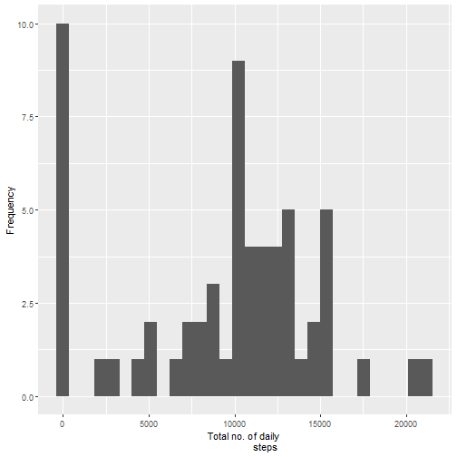
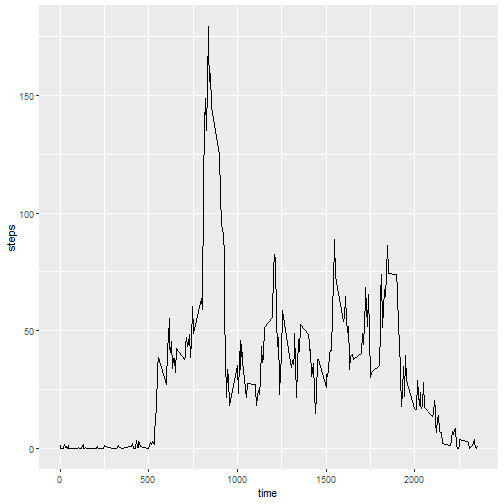
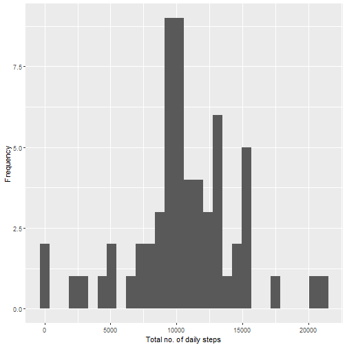
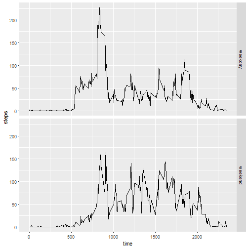

Reproducible Research Week 2: Course Project 1
==============================================

This assignment involves the analysis of data from a personal activity
monitoring device, which collects data at 5 minute intervals throughout 
the day. The data consists of two months of data from an anonymous 
individual collected during the months of October and November, 2012 and 
include the number of steps taken in 5 minute intervals each day.

Let's first load, explore and pre-process the data!

Loading and pre-processing of data:


```r
data <- read.csv("activity.csv", header = T, na.strings = "NA",
                 colClasses = c("numeric", "character", "numeric"))
data$date <- as.Date(data$date, "%Y-%m-%d")
str(data)
```

```
## 'data.frame':	17568 obs. of  3 variables:
##  $ steps   : num  NA NA NA NA NA NA NA NA NA NA ...
##  $ date    : Date, format: "2012-10-01" "2012-10-01" "2012-10-01" ...
##  $ interval: num  0 5 10 15 20 25 30 35 40 45 ...
```

```r
head(data)
```

```
##   steps       date interval
## 1    NA 2012-10-01        0
## 2    NA 2012-10-01        5
## 3    NA 2012-10-01       10
## 4    NA 2012-10-01       15
## 5    NA 2012-10-01       20
## 6    NA 2012-10-01       25
```


The first part of the assignment required us to calculate the number of
steps taken per day, plot a histogram for this, and find its mean and 
median.

The total number of steps per day can be obtained using tapply;

```r
total <- with(data, tapply(steps, date, sum, na.rm=T))
```

the histogram can be easily obtained with the following codes;

```r
library(ggplot2)
plot1 <- qplot(total, geom = "histogram", xlab = "Total no. of daily 
               steps", ylab = "Frequency")
plot1
```

```
## `stat_bin()` using `bins = 30`. Pick better value with `binwidth`.
```



and codes for the mean and median are straightforward enough.

```r
mean(total)
```

```
## [1] 9354.23
```

```r
median(total)
```

```
## [1] 10395
```


The second part of the assignment looked at the average daily activity
pattern of the individual. The time series can be obtained via a few 
steps. 

First, the total number of step at each interval can be obtained using
tapply, and dividing this by the number of days gives us the average
number of steps at each interval.

```r
step_at_time <- with(data, tapply(steps, interval, sum, na.rm=T))
avg_step_at_time <- step_at_time/length(total)
```

This data can then be made into a dataframe to plot the time series
required.

```r
timeseries <- data.frame(time = data$interval[1:288],
                         steps = avg_step_at_time)
plot2 <- ggplot(timeseries, aes(x = time, y = steps)) + geom_line()
plot2
```



Finally, the interval that contains the maximum number of steps can be 
obtained using:

```r
timeseries[which.max(timeseries$steps),]
```

```
##     time    steps
## 835  835 179.1311
```


The third part of the assignment looks at inputing missing values and 
making a new dataset.

First, the total number of missing values can be obtained using:

```r
sum(is.na(data$steps))
```

```
## [1] 2304
```

Next, I will input the missing values using the mean for each time
interval, since this has already been calculated in Part 2. The following 
codes produce this, and an additional layer of check is conducted to make
sure the new dataset contains no NAs.

```r
new_data <- data  
for (i in 1:nrow(data)){
    if(is.na(data$steps[i])){
        new_data$steps[i] <- timeseries$steps[new_data$interval[i] == 
                                              timeseries$time]
  }
}
sum(is.na(new_data$steps))
```

```
## [1] 0
```

The code to produce the histogram is similar to that in part 1:

```r
new_total <- with(new_data, tapply(steps, date, sum, na.rm=T))
plot3 <- qplot(new_total, geom = "histogram", 
                xlab = "Total no. of daily steps",
                ylab = "Frequency")
plot3
```

```
## `stat_bin()` using `bins = 30`. Pick better value with `binwidth`.
```



and so are the codes to produce the mean and median, albeit presented
differently:

```r
table <- matrix(c(mean(total), mean(new_total), 
                  median(total), median(new_total)),
                  ncol = 2, byrow = T)
colnames(table) <- c("Original data", "Edited data")
rownames(table) <- c("Mean", "Median")
table <- as.table(table)
table
```

```
##        Original data Edited data
## Mean         9354.23    10581.01
## Median      10395.00    10395.00
```

From this, we can see that the mean of the new data is higher, which may
represent an overestimation of the number of steps than if we were to leave
it empty. Meanwhile, the median remains unchanged. Inputting of data may 
therefore alter the summary statistics of datasets.


Finally, the fourth part of the assignment involved looking at activity
patterns in the weekdays vs. weekends. To begin, a new dataset with a
new variable is created using:

```r
new_data_w <- new_data
new_data_w$date <- as.Date(new_data_w$date, "%Y-%m-%d")
new_data_w$day <- weekdays(new_data_w$date)
new_data_w$day <- ifelse(new_data_w$day %in% c("Saturday", "Sunday"),
                         "Weekend", "Weekday")
```

Next, I calculated the average number of steps at each interval for
both weekdays and weekends combined:

```r
weekday <- subset(new_data_w, day == "Weekday")
weekend <- subset(new_data_w, day == "Weekend")

weekday_steps <- with(weekday, tapply(steps, interval, sum, na.rm=T))
avg_weekday_steps <- weekday_steps/45
weekend_steps <- with(weekend, tapply(steps, interval, sum, na.rm=T))
avg_weekend_steps <- weekend_steps/16
```

Lastly, a new data frame is created and the time series is plotted
using this data frame:

```r
new_timeseries <- data.frame(time = new_data_w$interval[1:288],
                             steps = c(avg_weekday_steps, 
                                       avg_weekend_steps),
                             day = rep(c("weekday", "weekend"), each = 
                                         288))
plot4 <- ggplot(new_timeseries, aes(x = time, y = steps)) 
plot4 + geom_line() + facet_grid(day~.) + labs(x = "time") + labs(y = "steps")
```




